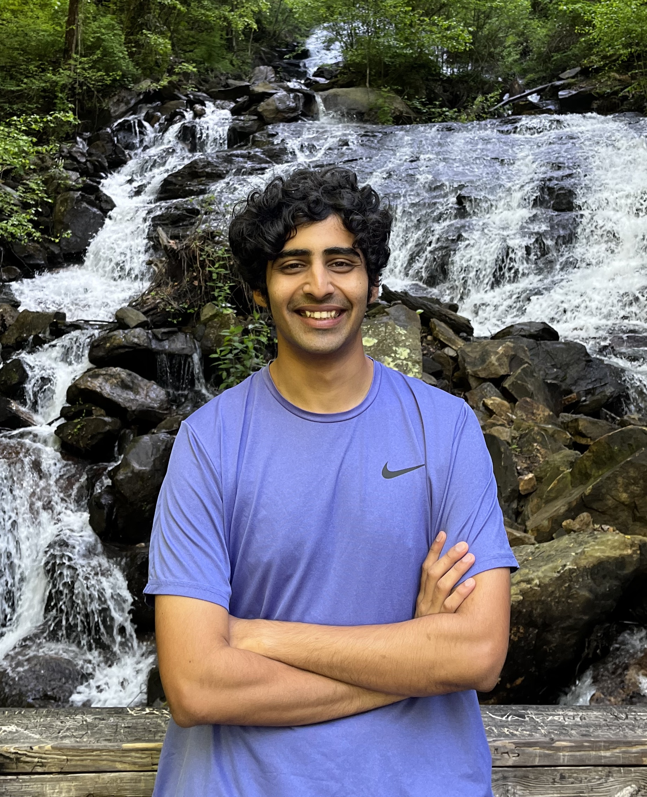
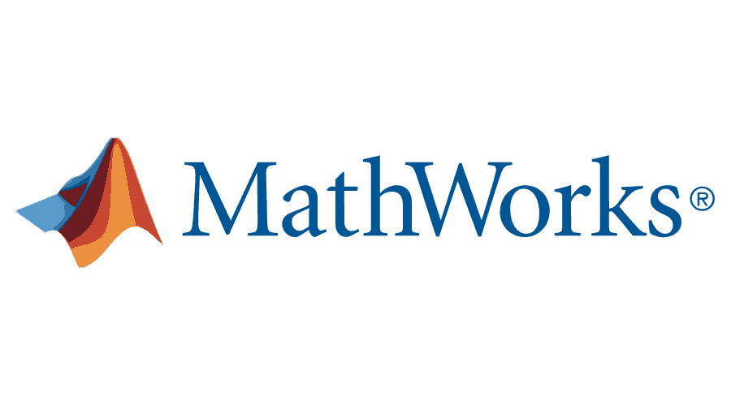

<!--  -->

<!-- Hi,
Hope you are doing well, and thanks for stopping by !

I am actively looking for full-time SDE roles starting from May 2024. Kindly let me know if you have any leads.
Here's a brief Introduction for me -  -->

I am a graduate student at Georgia Tech, pursuing a Master of Science in Computer Science. I have experience in Software Development, machine learning and optimization. I have done a number of development projects involving Python, C++ and JavaScript. Modeling real world problems into mathematical models and then finding clever ways of solving them is something that I truly enjoy. I have leveraged my coding skills while interning at MathWorks this summer and for six months in 2021, where I wrote production quality, scalable code in multiple major projects.
My hobbies are playing basketball and debating. Feel free to have a strong opinion on any topic conversing with me, always interested in learning multiple perspectives on any topic :)

<!-- Hi! My name is Siddharth Singh Solanki.

I am pursuing a Master's in Computer Science at GeorgiaTech.

I am interested in the fields of **Machine Learning, Speech Processing** and **Computational Neuroscience**.

I plan to use this website as a medium for sharing projects and other random thoughts.

If in a hurry, you can have a look at my [CV]({{site.url}}/cv).

I blog about my experiences [here]({{site.url}}/blog.html). -->

## Updates and Milestones

<!-- 
 -->

* **Jan 2024** - 
 Resumed working on CollabNext portal ([news](https://research.gatech.edu/georgia-tech-awarded-15m-build-people-centric-network-national-research-database)) for my Master's project under Prof. Kexin Rong.
 Returned to CS 3510 - Design and Analysis of Algorithms as a Graduate Teaching Assistant. 

* **Sep - Nov 2023** - 
 Introduced diffusion models to substitute image augmentations in the contrastive learning approach used in the paper [SimCLR](https://arxiv.org/abs/2002.05709). Achieved better compute efficiency and increased Top-1 accuracy. This was a course project for [CS 7647](https://sites.google.com/view/cs7647fa23/schedule?authuser=0) - Machine Learning with Limited Supervision. [Final Slides](https://docs.google.com/presentation/d/1Ncj20IttlGd4c3X-h1ql0oCYVr4w71eiWZ3eaWJymZQ/edit?usp=sharing). [Teaser Video].(https://www.youtube.com/watch?v=MJC6Dt87srE)

 
* **May - August 2023** - 
 Interned at MathWorks again this summer. This time got the opportunity to work on Parsim command with massive simulations team. Intorduced a function handle which reduced execution time for a typical workflow by three times. This code will be shipped with 2024-a release of Matlab!
 

* **August 2022** - 
 Joined Georgia Tech for Master's in Computer Science!!

* **August 2023**: Completed a 3-month internship at Qualcomm!
* **March 2023**: Gave a short presentation on In-Context Learning. Slides can be accessed [here]({{site.url}}/assets/pdf/icl.pdf).
* **November 2022**: Gave a short presentation on Stable Diffusion. Slides can be accessed [here]({{site.url}}/assets/pdf/sd_ppt.pdf).
* **August 2022**: Joined [BRAINML@GT](https://sites.google.com/view/brainml/home) and started working with Prof. Anqi Wu
on disentanglement of latent variables in VAEs  
* **August 2022**: Joined GeorgiaTech for a Master's in CS!
* **June 2022**: Presented Stage 2 of my Dual-Degree Project titled _Assessing Comprehensibility of Children's Read Speech_. Report available in [Projects]({{site.url}}/projects.html) section.
* **April 2022**: Accepted an offer from GeorgiaTech for a Master's in Computer Science!
* **January 2022**: Our work on *Deep Learning for Prominence Detection in Children’s Read Speech* got accepted at ICASSP 2022!
* **January 2022**: Gave a [presentation]({{site.url}}/assets/pdf/dap_wav2vec.pdf) on Wav2vec 2.0 as part of DAP lab at IIT Bombay.
* **October 2021**: Presented Stage 1 of my Dual-Degree Project titled _Deep Learning for Prominence Detection in Children’s Read Speech_. Report available in [Projects]({{site.url}}/projects.html) section. 
* **October 2021**: Submitted our work on *Deep Learning for Prominence Detection in Children’s Read Speech* to ICASSP 2022. Preprint available on [arXiv](https://arxiv.org/abs/2110.14273).
* **March 2021**: Started my tenure as an Editorial Board Member for [Insight](https://www.insightiitb.org),
  IIT Bombay's student media body.
* **June 2020**: Completed a Hardware Development internship at [APT Portfolio](http://aptportfolio.com). I [blogged]() about my experience!
<!-- 
 -->

